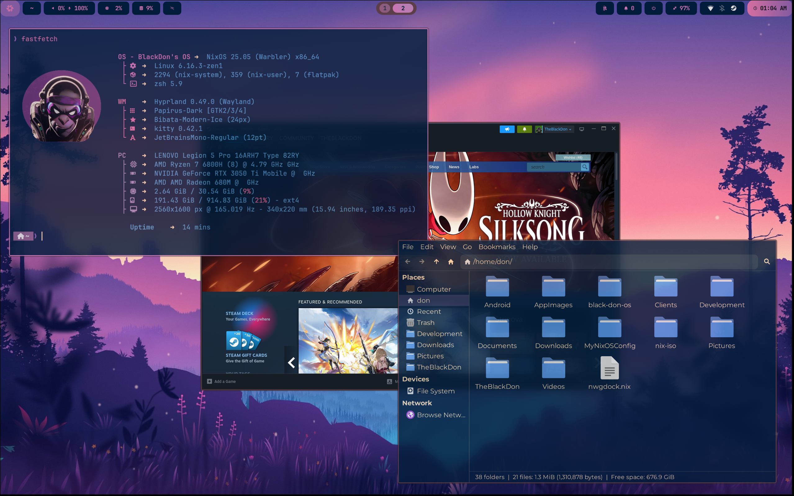

# ❄️ Black Don OS - Powered by NixOS ❄️

A user-friendly NixOS configuration based on [ZaneyOS](https://gitlab.com/zaney/zaneyos), designed for newcomers and experienced users alike.



## 🌟 What is Black Don OS?

Black Don OS is a pre-configured NixOS setup that makes it easy to get started with NixOS. It features:

- 🪟 **Dual Window Managers** - Both Hyprland and Niri available at login (no rebuild needed!)
- 🎨 **Beautiful Desktop** - Modern Wayland compositors with smooth animations
- 📦 **Modular Design** - Enable only the features you need
- 🎮 **Multi-GPU Support** - NVIDIA, AMD, Intel, and hybrid laptop configurations
- 🚀 **Quick Installation** - Simple installer with sensible defaults
- 📚 **Great for Learning** - Perfect for NixOS newcomers

## ⚡ Quick Start

### System Requirements

**Minimum Requirements:**
- **CPU**: 64-bit processor (x86_64)
- **RAM**: 4 GB (8 GB recommended)
- **Storage**: 30 GB free space (50 GB+ recommended)
- **Graphics**: Any GPU with basic 3D acceleration
- **Display**: 1280x720 or higher resolution
- **Boot**: UEFI or Legacy BIOS support
- **Internet**: Required during installation

**Recommended for Best Experience:**
- **CPU**: Modern quad-core processor (Intel i5/Ryzen 5 or better)
- **RAM**: 16 GB or more
- **Storage**: 100 GB+ SSD
- **Graphics**: Dedicated GPU (NVIDIA/AMD) for best compositor performance
- **Display**: 1920x1080 or higher, multi-monitor supported

> **💡 Note:** Black Don OS works great on older hardware too! The minimal install is lightweight, and you can enable heavier features only if you want them.

### Installation

Black Don OS installs directly on your hardware, replacing or dual-booting with your existing system.

> **📝 Note:** Don't be intimidated by the steps below! The process is straightforward:
> 1. Boot NixOS ISO → Install base NixOS → Reboot
> 2. Run Black Don OS installer → Reboot
> 3. Done! The whole process takes about 30-45 minutes.

#### Step 1: Create NixOS Installation Media
1. Download the **GNOME ISO** from [nixos.org/download](https://nixos.org/download)
   - Choose "GNOME, 64-bit Intel/AMD" under "Graphical ISO image"
2. Create a bootable USB drive with the ISO using:
   - [Etcher](https://etcher.balena.io/) (Windows/Mac/Linux)
   - [Rufus](https://rufus.ie/) (Windows)
   - `dd` command (Linux)
3. Boot your computer from the USB drive

#### Step 2: Install Base NixOS System
1. **Boot from the NixOS ISO** - you'll see the GNOME desktop
2. **Connect to WiFi** (if needed) using the network icon in the top-right corner
3. **Open the NixOS installer**:
   - Double-click the "Install NixOS" icon on the desktop
   - Or search for "Calamares" in the application menu

4. **Follow the graphical installer**:
   - **Welcome**: Select your language
   - **Location**: Choose your timezone
   - **Keyboard**: Select your keyboard layout
   - **Partitions**: Choose how to set up your disk
     - "Erase disk" for a clean install (recommended for beginners)
     - "Manual partitioning" for advanced users or dual-boot
   - **Users**: Create your username and password
   - **Summary**: Review your choices
   - **Install**: Click "Install" and wait (takes 10-15 minutes)

5. **Reboot into your new NixOS system**:
   - Click "Restart now" when installation completes
   - Remove the USB drive when prompted

#### Step 3: Install Black Don OS
1. **Log in to your new NixOS system** with the user you created

2. **Open a terminal** (press `Super` key and type "terminal")

3. **Install required tools**:
   ```bash
   nix-shell -p git pciutils
   ```

4. **Clone and run the Black Don OS installer**:
   ```bash
   git clone https://gitlab.com/theblackdon/black-don-os
   cd black-don-os
   ./install.sh
   ```

The installer will:
- ✅ Detect your hardware automatically
- ✅ Ask for hostname and username (only 3 questions!)
- ✅ Generate hardware configuration
- ✅ Build and install Black Don OS
- ✅ Set up both Hyprland and Niri window managers

5. **Reboot to complete installation**:
   ```bash
   reboot
   ```

**That's it!** After the final reboot, you'll see the SDDM login screen where you can:
- Log in with your username
- Choose between Hyprland or Niri from the session menu
- Enjoy your new Black Don OS desktop!

### What You Get Out of the Box

- **Browser**: Zen Browser
- **Terminal**: Kitty
- **Shell**: Zsh with starship prompt
- **Bar**: Noctalia
- **File Manager**: Thunar
- **Window Managers**: Both Hyprland and Niri
- **Theming**: Stylix for system-wide color coordination
- **Feature Modules**: Enable multiple features like Gaming Support, and Additional Browsers

## 🎨 Customization

After installation, customize your system by editing:

```bash
~/black-don-os/hosts/YOUR-HOSTNAME/variables.nix
```

### Common Customizations

#### Change Bar
```nix
barChoice = "noctalia"; # Options: "noctalia"
```

#### Change Your Wallpaper
```nix
stylixImage = ../../wallpapers/Valley.jpg;  # Choose from wallpapers/ directory
```

#### Enable Optional Features
```nix
enableCommunicationApps = true;  # Discord, Teams, Zoom, Telegram
enableExtraBrowsers = true;      # Chromium, Firefox, Brave
enableProductivityApps = true;   # Obsidian, GNOME Boxes
controllerSupportEnable = true;  # Gaming controllers
```

#### Change Default Apps
```nix
browser = "firefox";    # or "vivaldi", "brave", "chromium"
terminal = "alacritty"; # or "ghostty", "kitty"
defaultShell = "fish";  # or "zsh"
```

#### Configure Your Monitors
```nix
extraMonitorSettings = ''
  monitor=HDMI-A-1,1920x1080@60,0x0,1
  monitor=DP-1,2560x1440@144,1920x0,1
'';
```

After making changes, rebuild:
```bash
dcli rebuild
# or simply use the alias:
fr
```

## 🪟 Window Managers

Both window managers are always available - just select which one you want at login!

### Hyprland
- Modern Wayland compositor
- Beautiful animations
- Tiling window management
- Great for productivity

### Niri
- Scrollable tiling compositor
- Unique workflow
- Smooth animations
- Innovative window management

**No rebuild needed to switch!** Just log out and select the other at the login screen.

## 🎮 GPU Support

Black Don OS automatically detects and configures:

- **NVIDIA Desktop** - Full NVIDIA driver support
- **NVIDIA Laptop** - Hybrid Intel/NVIDIA with Prime
- **AMD** - Open-source AMDGPU drivers
- **Intel** - Integrated graphics
- **Virtual Machines** - Optimized for VMs

## 📁 Project Structure

```
black-don-os/
├── hosts/              # Your host configurations
│   ├── YOUR-HOST/      # Your computer's config
│   └── default/        # Template for new hosts
├── modules/
│   ├── core/          # System configuration
│   ├── drivers/       # GPU drivers
│   └── home/          # User environment (Hyprland, Niri, etc.)
├── profiles/          # Hardware profiles (nvidia, amd, intel, vm)
├── wallpapers/        # Desktop wallpapers
└── install.sh         # Simple installer
```

## 🔧 Advanced Usage

### Adding a New Computer

To install Black Don OS on another computer:

1. Clone the repo on the new machine
2. Run `./install.sh` with a different hostname
3. Your configurations are kept separate in `hosts/`

### Multiple Hosts

Each computer gets its own directory under `hosts/`:
- `hosts/my-desktop/` - Your desktop configuration
- `hosts/my-laptop/` - Your laptop configuration

They can have completely different settings, packages, and features enabled.

### Updating Your System

```bash
cd ~/black-don-os
dcli pull      # Pull latest changes
dcli update    # Update flake inputs and rebuild
# or use the alias:
fu             # Fast update
```

## 🆘 Troubleshooting

### Build Failures

If the build fails, try:
```bash
# Generate diagnostic report
dcli diag

# Rebuild with detailed output
sudo nixos-rebuild switch --flake ~/black-don-os#YOUR-HOSTNAME --show-trace
```

### Monitor Not Working

Update your monitor settings in `hosts/YOUR-HOSTNAME/variables.nix`:
```bash
# Find your monitors
hyprctl monitors  # (after first login)

# Update extraMonitorSettings with correct output names
```

### NVIDIA Prime Not Working

For hybrid laptops, find your GPU IDs:
```bash
lspci | grep VGA

# Update intelID and nvidiaID in variables.nix
```

### Hyprlock Conflicting with Other Lock Screens

If using Noctalia lock screens:
```nix
enableHyprlock = false;  # in variables.nix
```

## 🛠️ dcli - Don's CLI Tool

Black Don OS includes `dcli`, a powerful command-line utility for managing your system:

### Quick Commands
```bash
dcli rebuild      # Rebuild current system
dcli update       # Update and rebuild
dcli list-hosts   # List available configurations
dcli cleanup      # Remove old generations
dcli diag         # Generate diagnostic report

# Convenient aliases
fr                # Fast rebuild (dcli rebuild)
fu                # Fast update (dcli update)
```

See [dcli.md](dcli.md) for complete documentation.

## 💡 Tips for NixOS Newcomers

- **Use dcli commands** - Simpler than remembering nixos-rebuild syntax
- **Everything is declarative** - Your entire system is defined in text files
- **Rebuilding is safe** - If something breaks, boot into the previous generation
- **No reinstall needed** - Just edit files and rebuild with `fr`
- **Git is your friend** - Use `dcli commit` to track your configuration changes
- **Read the variables** - Most customization happens in `variables.nix`

## 🤝 Getting Help

- Check `hosts/default/variables.nix` for all available options
- Read the [NixOS Wiki](https://nixos.wiki/)
- Visit [NixOS Discourse](https://discourse.nixos.org/)
- Check original [ZaneyOS documentation](https://gitlab.com/zaney/zaneyos)

## 📜 Credits

- **ZaneyOS** - Original configuration by Tyler Kelley
- **NixOS** - The amazing Linux distribution
- **Hyprland** - Modern Wayland compositor
- **Niri** - Innovative scrollable compositor
- **Stylix** - System-wide theming

## 📄 License

Based on ZaneyOS. See [LICENSE](LICENSE) for details.

---

**Enjoy your Black Don OS experience!** 🚀

*Made with ❤️ for the NixOS community*
