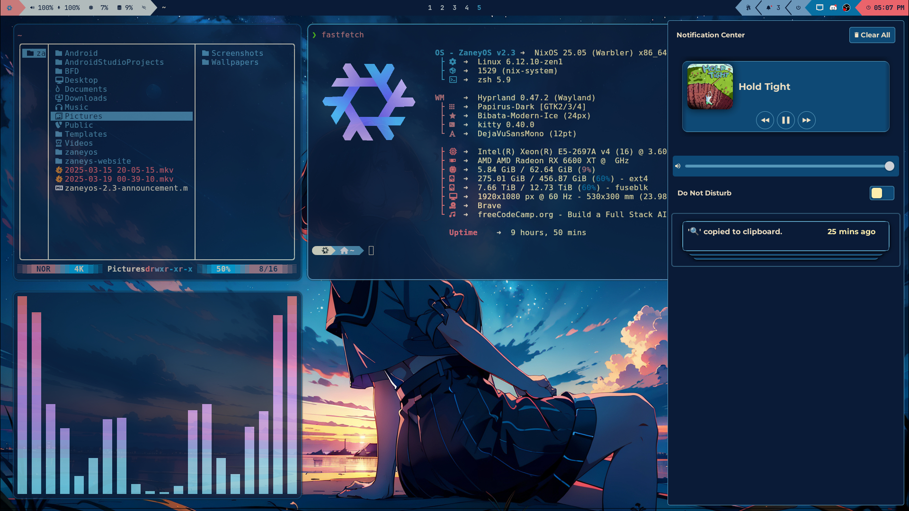

<div align="center">

## ZaneyOS 🟰 Best ❄️ NixOS Configs

ZaneyOS is a simple way of reproducing my configuration on any NixOS system.
This includes the wallpaper, scripts, applications, config files, and more.


**Inspiration for the Waybar config
[here](https://github.com/justinlime/dotfiles).**

</div>

> **This project has a [Wiki](https://zaney.org/wiki/zaneyos-2.3/). Find out how
> to use ZaneyOS here!** **dwilliam62 have put a lot of effort into the
> [FAQ](https://zaney.org/wiki/zaneyos-2.3/faq) so it should be accurate.
> However, please if you notice that something is wrong with it create an issue
> or reach out to us on Discord.**

#### 🍖 Requirements

- You must be running on NixOS, version 23.11+. 
- The zaneyos folder (this repo) is expected to be in your home directory.
- Must have installed using **GPT** & **UEFI**. Systemd-boot is what is supported, for
  GRUB you will have to brave the internet for a how-to. ☺️
- Manually editing your host specific files. The host is the specific computer
  your installing on.

#### 🎹 Pipewire & Notification Menu Controls

- We are using the latest and greatest audio solution for Linux. Not to mention
  you will have media and volume controls in the notification center available
  in the top bar.

#### 🏇 Optimized Workflow & Simple Yet Elegant Neovim

- Using Hyprland for increased elegance, functionality, and effeciency.
- No massive Neovim project here. This is my simple, easy to understand, yet
  incredible Neovim setup.

#### 🖥️ Multi Host & User Configuration

- You can define separate settings for different host machines and users.
- Easily specify extra packages for your users in the modules/core/user.nix
  file.
- Easy to understand file structure and simple, but encompassing, configuration.

#### 👼 An Incredible Community Focused On Support

- The entire idea of ZaneyOS is to make NixOS an approachable space that is
  actually a great community that you want to be in.
- Many people who are patient and happy to spend their free time helping you are
  running ZaneyOS. Feel free to reach out on the Discord for any help with
  anything.

<div align="center">

Please do yourself a favor and
[read the wiki](https://zaney.org/wiki/zaneyos-2.3/).

</div>

#### 📦 How To Install Packages?

- You can search the [Nix Packages](https://search.nixos.org/packages?) &
  [Options](https://search.nixos.org/options?) pages for what a package may be
  named or if it has options available that take care of configuration hurdles
  you may face.
- To add a package there are the sections for it in `modules/core/packages.nix`
  and `modules/core/user.nix`. One is for programs available system wide and the
  other for your users environment only.

#### 🙋 Having Issues / Questions?

- Please feel free to raise an issue on the repo, please label a feature request
  with the title beginning with [feature request], thank you!
- Contact me on [Discord](https://discord.gg/2cRdBs8) as well, for a potentially
  faster response.

# Hyprland Keybindings

Below are the keybindings for Hyprland, formatted for easy reference.

## Application Launching
- `$modifier + Return` → Launch `Terminal`
- `$modifier + K` → List keybinds
- `$modifier + Shift + Return` → Launch `rofi-launcher`
- `$modifier + Shift + W` → Open `web-search`
- `$modifier + Alt + W` → Open `wallsetter`
- `$modifier + Shift + N` → Run `swaync-client -rs`
- `$modifier + W` → Launch `Web Browser`
- `$modifier + Y` → Open `kitty` with `yazi`
- `$modifier + E` → Open `emopicker9000`
- `$modifier + S` → Take a screenshot
- `$modifier + D` → Open `Discord`
- `$modifier + O` → Launch `OBS Studio`
- `$modifier + C` → Run `hyprpicker -a`
- `$modifier + G` → Open `GIMP`
- `$modifier + V` → Show clipboard history via `cliphist`
- `$modifier + T` → Toggle terminal with `pypr`
- `$modifier + M` → Open `pavucontrol`

## Window Management
- `$modifier + Q` → Kill active window
- `$modifier + P` → Toggle pseudo tiling
- `$modifier + Shift + I` → Toggle split mode
- `$modifier + F` → Toggle fullscreen
- `$modifier + Shift + F` → Toggle floating mode
- `$modifier + Alt + F` → Float all windows
- `$modifier + Shift + C` → Exit Hyprland

## Window Movement
- `$modifier + Shift + ← / → / ↑ / ↓` → Move window left/right/up/down
- `$modifier + Shift + H / L / K / J` → Move window left/right/up/down
- `$modifier + Alt + ← / → / ↑ / ↓` → Swap window left/right/up/down
- `$modifier + Alt + 43 / 46 / 45 / 44` → Swap window left/right/up/down

## Focus Movement
- `$modifier + ← / → / ↑ / ↓` → Move focus left/right/up/down
- `$modifier + H / L / K / J` → Move focus left/right/up/down

## Workspaces
- `$modifier + 1-10` → Switch to workspace 1-10
- `$modifier + Shift + Space` → Move window to special workspace
- `$modifier + Space` → Toggle special workspace
- `$modifier + Shift + 1-10` → Move window to workspace 1-10
- `$modifier + Control + → / ←` → Switch workspace forward/backward

## Window Cycling
- `Alt + Tab` → Cycle to next window
- `Alt + Tab` → Bring active window to top


## ⬇️ Install

Don't forget to checkout the [FAQ](https://zaney.org/wiki/zaneyos-2.3/faq)

### 📜 Script:

This is the easiest and recommended way of starting out. The script is not meant
to allow you to change every option that you can in the flake or help you
install extra packages. It is simply here so you can get my configuration
installed with as little chances of breakages and then fiddle to your hearts
content!

Simply copy this and run it:


```
nix-shell -p git curl pciutils 
```

Then:


```
sh <(curl -L https://gitlab.com/Zaney/zaneyos/-/raw/stable-2.3/install-zaneyos.sh)
```

#### The install process will look something like this:


#### After the install completes your environment will probably look broken. Just reboot and you will see this as your login:


#### Then after login you should see a screen like this:



#### 🦽 Manual:

1. Run this command to ensure Git & Vim are installed:

```
nix-shell -p git vim
```

2. Clone this repo & enter it:

```
cd && git clone -b stable-2.3 --single-branch https://gitlab.com/Zaney/zaneyos.git
cd zaneyos
```

- _You should stay in this folder for the rest of the install_

3. Create the host folder for your machine(s) like so:

```
cp -r hosts/default hosts/<your-desired-hostname>
```

4. Edit `hosts/<your-desired-hostname>/variables.nix`.

5. Edit `flake.nix` and fill in your username, profile, and hostname.

6. Generate your hardware.nix like so:

```
nixos-generate-config --show-hardware-config > hosts/<your-desired-hostname>/hardware.nix
```

7. Run this to enable flakes and install the flake replacing hostname with
   whatever you put as the hostname:

```
NIX_CONFIG="experimental-features = nix-command flakes" 
sudo nixos-rebuild switch --flake .#profile
```

Now when you want to rebuild the configuration you have access to an alias
called `fr` that will rebuild the flake and you do not have to be in the
`zaneyos` folder for it to work.

Hope you enjoy!
